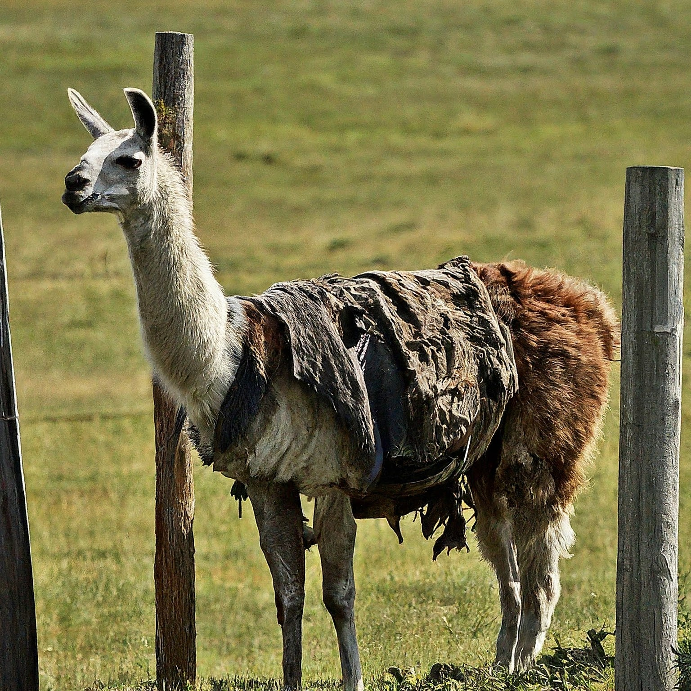

# Rustic llama

A [Rust](https://www.rust-lang.org/) 🦀 based llama2 implementation



* Writen based on [llama2.c](https://github.com/karpathy/llama2.c.git)
* Created with the purpose of understanding the inference process in LLMs.


## Current Performance 
50 tok/s 

```
CPU: Intel(R) Core(TM) i7-1065G7 CPU @ 1.30GHz
MemTotal:       32620848 kB
```